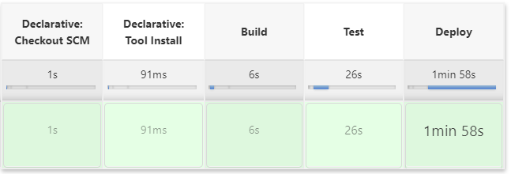

# Quiz-app

### Information

<ul style="list-style-type:discs">

<li>This application has two profiles: local and heroku. The first one uses docker image of mongoDB, while heroku configures access to MongoDB Atlas service.</li> 
<li>The quiz-app uses jenkins tool, which is responsible for building, testing and deploying application on heroku.</li>

</ul>

### Rest API

Api is available at this link: https://quiz-app-v002.herokuapp.com/swagger-ui.html (it may take a few for heroku to run)

### Jenkins

The result of pipeline from Jenkinsfile that is added to this project:

